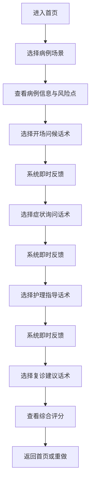
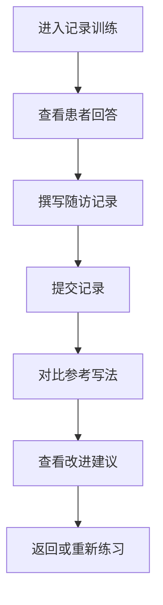
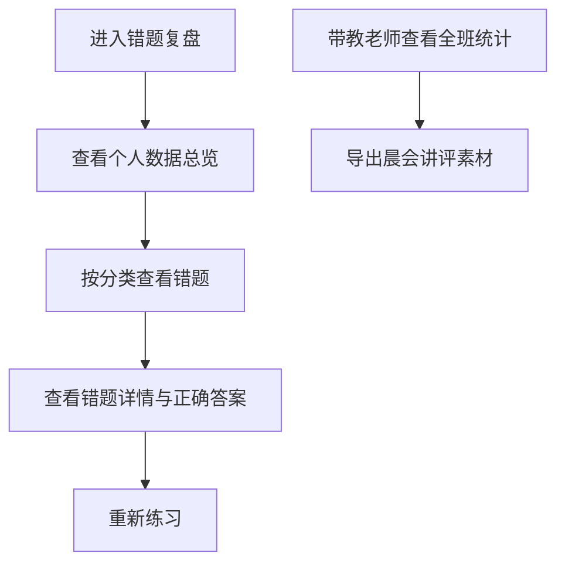

## 1. 产品概述

面向口腔护理师培训班和新入职洁牙师的模拟随访练习App，通过趣味化场景训练提升洁治后的沟通能力，帮助培训机构和连锁诊所高效完成内部带教。

- **主要目的**：训练洁牙师与患者的术后随访沟通技巧，降低临床沟通风险
- **解决问题**：新入职人员缺乏真实沟通经验、沟通不规范、遗漏关键指导要点
- **目标用户**：口腔护理师培训班学员、新入职洁牙师、带教老师
- **市场价值**：标准化培训体系、提升培训效率、降低教学成本、统一沟通质量

## 2. 核心功能

### 2.1 用户角色

| 角色 | 注册方式 | 核心权限 |
|------|----------|----------|
| 学员用户 | 直接进入 | 场景练习、话术训练、记录训练、查看个人错题 |
| 带教老师 | 直接进入 | 查看所有学员错题统计、晨会讲评数据导出 |

### 2.2 功能模块

1. **首页/场景选择页**：病例卡片展示、难度标识、练习进度
2. **话术练习页**：病例信息展示、分步骤话术选择、即时反馈弹窗、得分统计
3. **随访记录训练页**：患者回答展示、记录编辑区、参考写法对比
4. **错题复盘页**：个人错题分类统计、薄弱环节分析、带教数据总览

### 2.3 页面详情

| 页面名称 | 模块名称 | 功能描述 |
|----------|----------|----------|
| 首页 | 场景选择卡片 | 展示3个核心病例场景，包含场景名称、患者画像、难度星级、完成状态 |
| 首页 | 功能入口导航 | 话术练习、记录训练、错题复盘三大功能入口 |
| 话术练习页 | 病例信息区 | 洁治记录、患者性格、关键风险点展示 |
| 话术练习页 | 步骤导航区 | 开场问候→症状询问→护理指导→复诊建议四步流程 |
| 话术练习页 | 话术选项区 | 每步3-4个选项，包含正确选项、常见错误选项、遗漏风险点 |
| 话术练习页 | 即时反馈区 | 选择后弹出反馈，指出遗漏点（刷牙方式/牙线/敏感期/复诊时机），提供正确话术 |
| 话术练习页 | 得分统计区 | 实时显示当前得分、正确率、已完成步骤 |
| 随访记录训练页 | 患者对话区 | 展示患者对随访问题的回答内容 |
| 随访记录训练页 | 记录编辑区 | 富文本输入框，学员整理成规范随访记录 |
| 随访记录训练页 | 参考对比区 | 提交后显示专业参考写法，标注差异点 |
| 错题复盘页 | 个人数据总览 | 练习次数、总正确率、薄弱环节雷达图 |
| 错题复盘页 | 错题分类列表 | 按遗漏类型（刷牙指导/牙线使用/敏感期/复诊时机）分类展示 |
| 错题复盘页 | 带教统计区 | 全班错题频次统计、晨会讲评建议题目列表 |

## 3. 核心流程

### 3.1 话术练习流程
学员进入首页 → 选择病例场景 → 查看病例详情和风险点 → 按步骤选择话术 → 系统即时反馈 → 完成所有步骤 → 查看综合评分 → 可选择重做或返回

### 3.2 随访记录训练流程
进入记录训练 → 查看患者回答内容 → 整理撰写规范记录 → 提交记录 → 对比参考写法 → 查看评分与改进建议

### 3.3 错题复盘流程
进入错题复盘 → 查看个人数据总览 → 选择错题分类 → 查看详细错题 → 重新练习薄弱环节 → 带教老师查看全班统计

## 4. 用户界面设计

### 4.1 设计风格

- **主色调**：医疗蓝（#1A73E8），代表专业、信任
- **辅助色**：清新薄荷绿（#34A853），代表健康、舒适；珊瑚橙（#FF6B6B），代表提醒、警示
- **背景色**：浅灰蓝渐变（#F8FAFC → #EEF2FF），营造干净专业的医疗氛围
- **按钮风格**：圆角矩形（border-radius: 12px），微立体阴影，悬停微动效
- **字体**：标题使用 "Noto Sans SC Bold"，正文使用 "Noto Sans SC Regular"，数字使用 "JetBrains Mono"
- **布局风格**：卡片式布局，清晰的视觉层级，充足留白
- **图标风格**：线性图标，统一2px描边，圆角端点

### 4.2 页面设计概述

| 页面名称 | 模块名称 | UI 元素 |
|----------|----------|---------|
| 首页 | 场景选择卡片 | 卡片悬浮动效、难度星级渐变、患者头像插画、完成状态标记 |
| 首页 | 功能导航 | 图标+文字按钮、渐变色块背景、点击波纹动效 |
| 话术练习页 | 步骤指示器 | 连接式进度条、已完成步骤打勾、当前步骤高亮闪烁 |
| 话术练习页 | 话术选项 | 选项悬停上浮、选中状态高亮、正确/错误边框颜色区分 |
| 话术练习页 | 反馈弹窗 | 半透明背景、图标动效（正确✓弹跳/错误✗抖动）、渐变色标题 |
| 随访记录训练页 | 对话气泡 | 患者消息气泡样式、时间戳、打字机文字出现效果 |
| 随访记录训练页 | 对比视图 | 左右分栏对比、差异点高亮标注、评分徽章 |
| 错题复盘页 | 数据可视化 | 雷达图薄弱分析、柱状图错题分类、进度环完成度 |
| 错题复盘页 | 错题列表 | 展开式错题卡片、标签分类、快速重练按钮 |

### 4.3 响应式设计

- **桌面端优先**：1280px 以上宽屏优化，三栏布局（病例信息+话术选择+反馈区）
- **平板适配**：768px-1279px，双栏布局，反馈区改为底部弹窗
- **手机适配**：768px 以下，单栏滚动布局，步骤改为顶部横向滚动
- **触摸优化**：按钮最小44x44px，滑动翻页支持，多指缩放查看病例图片

### 4.4 动效设计

- **页面进入**：内容从下往上渐入，卡片依次延迟出现（staggered animation）
- **选择反馈**：正确选项绿色扩散波纹，错误选项红色抖动
- **步骤切换**：横向滑动过渡，当前内容滑出，下一步内容滑入
- **数据加载**：骨架屏占位，内容淡入
- **悬停效果**：卡片轻微上浮（translateY(-4px)），阴影加深
