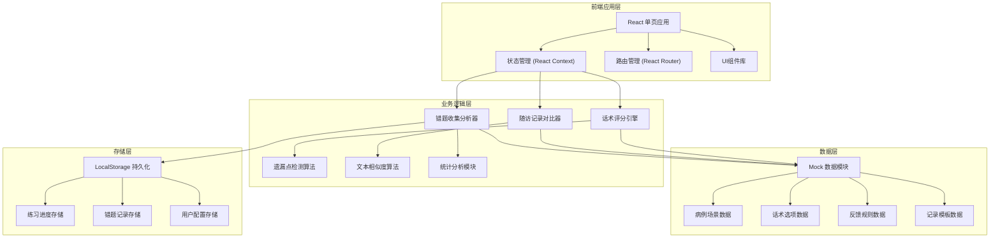
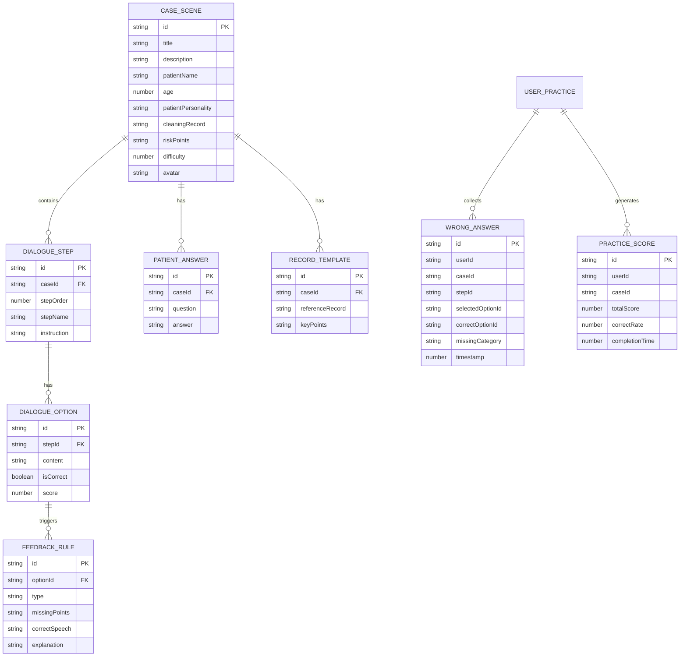

## 1. 架构设计



## 2. 技术描述

- **前端框架**: React@18 + TypeScript@5
- **构建工具**: Vite@5
- **样式方案**: TailwindCSS@3 + CSS Variables
- **路由管理**: React Router DOM@6
- **图标库**: Lucide React
- **图表库**: Recharts
- **动画库**: Framer Motion
- **状态管理**: React Context + useReducer
- **数据持久化**: LocalStorage (无需后端)
- **Mock 数据**: TypeScript 类型定义 + JSON 数据模块

## 3. 路由定义

| 路由 | 页面组件 | 功能说明 |
|------|----------|----------|
| `/` | `HomePage` | 首页 - 病例场景选择、功能入口导航 |
| `/practice/:caseId` | `PracticePage` | 话术练习页 - 分步骤话术选择与即时反馈 |
| `/record/:caseId` | `RecordTrainingPage` | 随访记录训练页 - 记录整理与参考对比 |
| `/review` | `ReviewPage` | 错题复盘页 - 个人数据统计与错题列表 |
| `/teacher` | `TeacherDashboard` | 带教统计页 - 全班错题统计与讲评素材 |

## 4. 数据模型

### 4.1 数据模型定义



### 4.2 TypeScript 类型定义

```typescript
// 病例场景
interface CaseScene {
  id: string;
  title: string;
  description: string;
  patientName: string;
  age: number;
  patientPersonality: string;
  cleaningRecord: string;
  riskPoints: string[];
  difficulty: 1 | 2 | 3;
  avatar: string;
  completed?: boolean;
  bestScore?: number;
}

// 话术步骤
interface DialogueStep {
  id: string;
  caseId: string;
  stepOrder: number;
  stepName: 'greeting' | 'symptom' | 'guidance' | 'followup';
  instruction: string;
  options: DialogueOption[];
}

// 话术选项
interface DialogueOption {
  id: string;
  content: string;
  isCorrect: boolean;
  score: number;
  feedback: Feedback;
}

// 反馈信息
interface Feedback {
  type: 'correct' | 'warning' | 'error';
  missingPoints: string[];
  correctSpeech: string;
  explanation: string;
}

// 错题记录
interface WrongAnswer {
  id: string;
  caseId: string;
  caseTitle: string;
  stepName: string;
  selectedContent: string;
  correctContent: string;
  missingCategory: 'brushing' | 'floss' | 'sensitivity' | 'recheck' | 'other';
  timestamp: number;
}

// 练习得分
interface PracticeScore {
  caseId: string;
  totalScore: number;
  maxScore: number;
  correctRate: number;
  completionTime: number;
  timestamp: number;
}

// 患者回答
interface PatientAnswer {
  question: string;
  answer: string;
}

// 随访记录模板
interface RecordTemplate {
  caseId: string;
  patientAnswers: PatientAnswer[];
  referenceRecord: string;
  keyPoints: string[];
}

// 用户数据
interface UserData {
  id: string;
  name: string;
  role: 'student' | 'teacher';
  practiceScores: PracticeScore[];
  wrongAnswers: WrongAnswer[];
}
```

## 5. 项目目录结构

```
src/
├── assets/              # 静态资源
│   ├── images/
│   └── icons/
├── components/          # 通用组件
│   ├── layout/
│   │   ├── Header.tsx
│   │   ├── Navigation.tsx
│   │   └── PageContainer.tsx
│   ├── ui/
│   │   ├── Button.tsx
│   │   ├── Card.tsx
│   │   ├── Modal.tsx
│   │   ├── ProgressBar.tsx
│   │   ├── StepIndicator.tsx
│   │   └── Badge.tsx
│   └── feedback/
│       ├── FeedbackModal.tsx
│       └── ScoreDisplay.tsx
├── data/                # Mock 数据
│   ├── cases.ts
│   ├── dialogues.ts
│   ├── records.ts
│   └── index.ts
├── hooks/               # 自定义 Hooks
│   ├── usePractice.ts
│   ├── useReview.ts
│   ├── useRecordTraining.ts
│   └── useLocalStorage.ts
├── pages/               # 页面组件
│   ├── HomePage.tsx
│   ├── PracticePage.tsx
│   ├── RecordTrainingPage.tsx
│   ├── ReviewPage.tsx
│   └── TeacherDashboard.tsx
├── store/               # 状态管理
│   ├── AppContext.tsx
│   └── AppReducer.ts
├── types/               # TypeScript 类型定义
│   └── index.ts
├── utils/               # 工具函数
│   ├── scoring.ts
│   ├── textComparison.ts
│   ├── statistics.ts
│   └── storage.ts
├── App.tsx
├── main.tsx
├── index.css
└── vite-env.d.ts
```

## 6. 核心算法说明

### 6.1 遗漏点检测算法
- 基于预定义的遗漏点分类（刷牙方式、牙线指导、敏感期说明、复诊时机）
- 每个话术选项预标记包含/遗漏的关键点
- 选择后根据标记的遗漏点生成反馈

### 6.2 文本相似度算法（随访记录对比）
- 使用 Levenshtein 距离计算编辑距离
- 关键词匹配评分（预定义专业术语权重）
- 结构完整性检测（必填字段检查）
- 综合得分 = 关键词匹配度 × 0.6 + 文本相似度 × 0.3 + 结构完整度 × 0.1

### 6.3 错题统计分析
- 按遗漏类别分组统计频次
- 计算每个类别的错误率
- 生成薄弱环节雷达图数据
- 按时间趋势分析进步情况

## 7. 前端性能优化

- **代码分割**: 按路由懒加载页面组件
- **状态优化**: 使用 useMemo/useCallback 避免不必要重渲染
- **数据缓存**: 练习数据本地持久化，减少重复计算
- **动画优化**: 使用 transform 而非 top/left，开启 GPU 加速
- **按需加载**: 图表组件按需引入，减小首屏包体积
